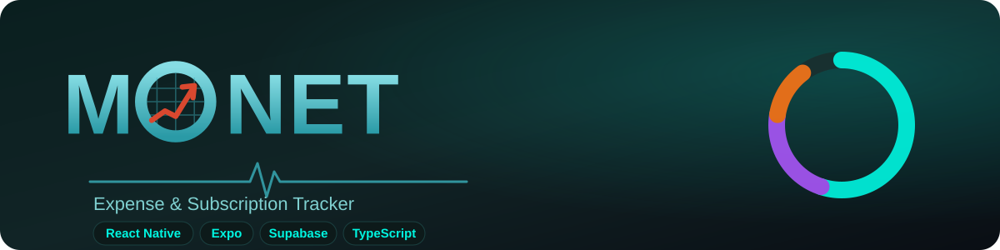
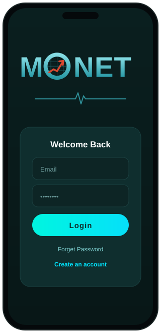
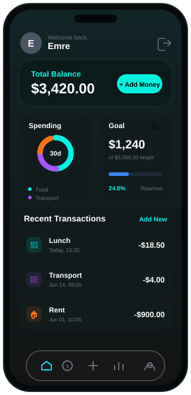
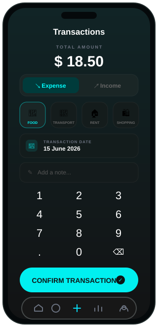
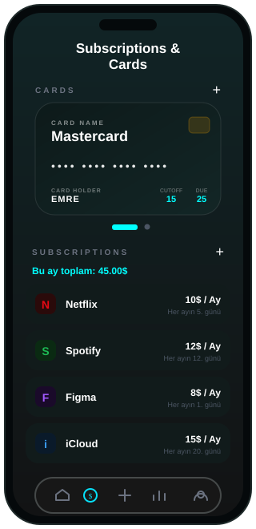
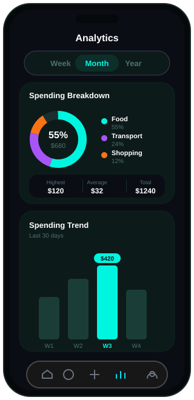
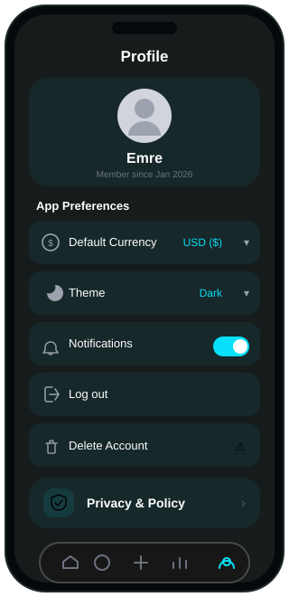
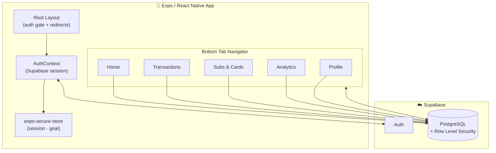
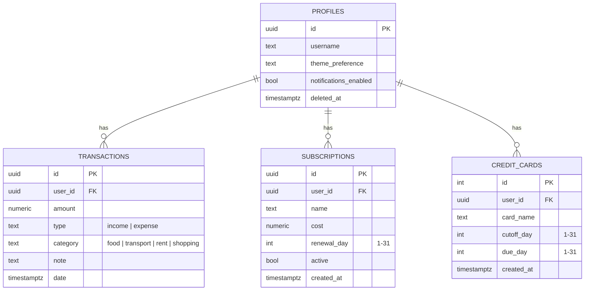

<div align="center">
  

  <h1>MONET</h1>

  <p>
    <b>A modern, mobile-first personal finance app to track expenses, manage subscriptions & credit cards, and visualize your spending — built with React Native, Expo Router & Supabase.</b>
  </p>

  <p>
    
    
    
    
    
    
  </p>
</div>

---

## 📖 Overview

**MONET** is a cross-platform mobile app that helps you stay on top of your money. Log income and expenses with a fast custom keypad, organize them by category, keep an eye on recurring subscriptions and credit-card cycles, set a monthly spending goal, and explore interactive charts that break down where your money goes.

Authentication, data storage, and per-user data isolation are powered by **Supabase** (PostgreSQL + Auth). The UI is a polished dark, turquoise-accented design built entirely with **NativeWind** (Tailwind for React Native) and custom SVG charts — no chart library dependency.

### ✨ Highlights

- 🔐 **Email/password auth** with secure session persistence (`expo-secure-store`)
- 💸 **Quick transaction entry** — custom numeric keypad, expense/income toggle, 4 categories, date & note
- 📊 **Dashboard** — total balance, 30-day spending donut, monthly goal progress, recent activity
- 💳 **Cards & subscriptions** — credit-card carousel (cutoff/due days) + subscription manager with monthly total
- 📈 **Analytics** — Week / Month / Year views, spending breakdown donut, animated trend bar chart, key stats
- 👤 **Profile** — currency selector, theme, notifications toggle, privacy policy & account deletion (in-app WebView)
- 🎨 **Custom design system** — dark turquoise theme, native bottom tab bar, hand-rolled SVG charts

---

## 📱 Visual Usage Guide

> The mockups below are rendered from the app's actual screen layouts and color system.

### 1. Sign In · `app/login.tsx`



Your entry point to the app.

- Enter your **email** and **password**.
- Tap **Login** to sign in via Supabase Auth.
- New here? Tap **Create an account** to register.
- Sessions are stored securely on-device and restored automatically on next launch, so you stay logged in.

<br clear="right" />

---

### 2. Home / Dashboard · `app/(tabs)/index.tsx`



Your financial snapshot at a glance.

- **Total Balance** — income minus expenses across all transactions. Tap **+ Add Money** to jump to the entry screen.
- **Spending donut** — your expense split by category over the last 30 days.
- **Goal card** — progress toward your monthly spending target. Tap it to set a new goal with a built-in keypad (saved on-device).
- **Recent Transactions** — your latest expenses with category icons.
- **Pull to refresh** to re-sync with the database.

<br clear="right" />

---

### 3. Add Transaction · `app/(tabs)/transactions.tsx`



Log money in or out in seconds.

1. Type the **amount** on the numeric keypad.
2. Pick **Expense** or **Income**.
3. Choose a **category** — Food, Transport, Rent or Shopping.
4. Set the **transaction date** (native date picker).
5. Optionally add a **note**.
6. Tap **Confirm Transaction** to save.

Input is validated (positive amount, sane limits, note length) before saving to Supabase.

<br clear="right" />

---

### 4. Subscriptions & Cards · `app/(tabs)/subsCards.tsx`



Keep recurring costs and billing cycles under control.

- **Cards** — a swipeable carousel of your credit cards. Tap **+** to add one (name, **cutoff day**, **due day**); tap a card to edit or delete it.
- **Subscriptions** — a list of recurring services with their monthly cost and renewal day. The header shows your **total monthly subscription spend**.
- Add via **+**, tap any item to edit or delete. Known brands (Netflix, Spotify, Figma…) get auto-colored icons.

<br clear="right" />

---

### 5. Analytics · `app/(tabs)/analytics.tsx`



Understand your spending patterns.

- Switch between **Week**, **Month** and **Year** ranges.
- **Spending Breakdown** — donut chart of expenses by category, with a legend and percentages.
- **Stats row** — Highest, Average and Total expense for the selected period.
- **Spending Trend** — an animated bar chart (by day / week / month depending on range).
- **Pull to refresh** to recompute from the latest data.

<br clear="right" />

---

### 6. Profile & Settings · `app/(tabs)/profile.tsx`



Manage your account and preferences.

- See your **name** and **member-since** date.
- **Default Currency** picker (USD, EUR, GBP, TRY, …).
- **Theme** and **Notifications** preferences.
- **Log out** to end your session.
- **Privacy & Policy** and **Delete Account** open the relevant pages in an in-app WebView.

<br clear="right" />

---

## 🧱 Tech Stack

| Layer | Technology |
| --- | --- |
| **Framework** | [Expo](https://expo.dev) SDK 54 · React Native 0.81 · React 19 |
| **Navigation** | [Expo Router](https://docs.expo.dev/router/introduction) (file-based) · React Navigation bottom tabs |
| **Language** | TypeScript 5.9 (typed routes enabled) |
| **Styling** | [NativeWind](https://www.nativewind.dev) (Tailwind CSS) · Expo Linear Gradient |
| **Backend / Auth** | [Supabase](https://supabase.com) — PostgreSQL + Auth |
| **State** | React Context (auth) · Redux Toolkit (UI) |
| **Storage** | `expo-secure-store` (session + monthly goal) |
| **Icons & Charts** | `lucide-react-native` · custom `react-native-svg` donut & bar charts |
| **Misc** | `expo-haptics`, `react-native-webview`, `@react-native-community/datetimepicker` |

---

## 🗺️ Architecture



**Auth gate:** `app/_layout.tsx` subscribes to Supabase's `onAuthStateChange`. Unauthenticated users are redirected to `/login`; authenticated users land on the `(tabs)` group. Every data query is scoped to the signed-in user's `id`.

---

## 🗄️ Data Model



---

## 📂 Project Structure

```
expense-subscription-tracker/
├── app/                          # Expo Router screens (file-based routing)
│   ├── _layout.tsx               # Root layout + auth gate / redirects
│   ├── login.tsx                 # Sign in
│   ├── signup.tsx                # Register
│   └── (tabs)/                   # Authenticated tab group
│       ├── _layout.tsx           # Native bottom tab bar
│       ├── index.tsx             # Home / Dashboard
│       ├── transactions.tsx      # Add transaction
│       ├── subsCards.tsx         # Subscriptions & credit cards
│       ├── analytics.tsx         # Charts & stats
│       └── profile.tsx           # Settings
├── src/
│   ├── contexts/AuthContext.tsx  # Supabase session provider
│   ├── lib/supabase.ts           # Supabase client (SecureStore adapter)
│   ├── features/auth/            # signIn / signUp helpers
│   └── components/               # CreditCard, FormInput, SVG icons…
├── store/                        # Redux Toolkit store (UI slice)
├── constants/theme.ts            # Theme tokens
├── supabase/migrations/          # SQL migrations
├── tailwind.config.js            # NativeWind theme / colors
└── app.json                      # Expo app config
```

---

## 🚀 Getting Started

### Prerequisites

- **Node.js** 18+ and npm
- **Expo Go** app on your phone, or an Android/iOS emulator
- A free **[Supabase](https://supabase.com)** project

### 1. Install

```bash
git clone <your-repo-url>
cd expense-subscription-tracker
npm install
```

### 2. Configure Supabase

The Supabase URL and anon key live in [`src/lib/supabase.ts`](src/lib/supabase.ts). Replace them with **your own** project's values:

```ts
const supabaseUrl = 'https://YOUR-PROJECT.supabase.co'
const supabaseAnonKey = 'YOUR-ANON-KEY'
```

> 💡 **Recommended:** move these into environment variables (`EXPO_PUBLIC_SUPABASE_URL` / `EXPO_PUBLIC_SUPABASE_ANON_KEY`) via an `.env` file and read them with `process.env.*` so secrets aren't committed. The anon key is public by design, but credentials are still best kept out of source control.

### 3. Create the database tables

Run this in the **Supabase SQL Editor**, then apply the migration in [`supabase/migrations/`](supabase/migrations/):

```sql
-- transactions
create table public.transactions (
  id uuid primary key default gen_random_uuid(),
  user_id uuid references auth.users(id) on delete cascade not null,
  amount numeric not null,
  type text not null check (type in ('income','expense')),
  category text,
  note text,
  date timestamptz not null default now()
);

-- subscriptions
create table public.subscriptions (
  id uuid primary key default gen_random_uuid(),
  user_id uuid references auth.users(id) on delete cascade not null,
  name text not null,
  cost numeric not null,
  renewal_day int not null check (renewal_day between 1 and 31),
  active boolean not null default true,
  created_at timestamptz not null default now()
);

-- credit_cards
create table public.credit_cards (
  id bigint generated always as identity primary key,
  user_id uuid references auth.users(id) on delete cascade not null,
  card_name text not null,
  cutoff_day int not null check (cutoff_day between 1 and 31),
  due_day int not null check (due_day between 1 and 31),
  created_at timestamptz not null default now()
);

-- Enable Row Level Security and add owner-only policies for each table
alter table public.transactions enable row level security;
alter table public.subscriptions enable row level security;
alter table public.credit_cards  enable row level security;

create policy "own rows" on public.transactions
  for all using (auth.uid() = user_id) with check (auth.uid() = user_id);
create policy "own rows" on public.subscriptions
  for all using (auth.uid() = user_id) with check (auth.uid() = user_id);
create policy "own rows" on public.credit_cards
  for all using (auth.uid() = user_id) with check (auth.uid() = user_id);
```

> ⚠️ **Row Level Security is essential.** Without these policies, the public anon key would expose every user's data. Make sure RLS is enabled on all tables.

### 4. Run

```bash
npm start          # Expo dev server (scan QR with Expo Go)
# or target a platform directly:
npm run android
npm run ios
npm run web
```

---

## 📜 Scripts

| Command | Description |
| --- | --- |
| `npm start` | Start the Expo dev server |
| `npm run android` | Open on Android emulator/device |
| `npm run ios` | Open on iOS simulator/device |
| `npm run web` | Run in the browser |
| `npm run lint` | Lint with `expo lint` |

---

## 🎨 Design System

The theme is defined in [`tailwind.config.js`](tailwind.config.js) and used via NativeWind utility classes.

| Token | Value | Usage |
| --- | --- | --- |
| `primary` | `#0a0e14` | App background |
| `card` / `card-secondary` | `#0d1a1a` / `#111b1b` | Card surfaces |
| `accent` | `#00f5e0` | Turquoise highlight / CTAs |
| `text-secondary` | `#6b7280` | Muted text |

**Category colors:** Food `#00f5e0` · Transport `#a855f7` · Rent `#f97316` · Shopping `#eab308`.

---

## 🛣️ Roadmap Ideas

- [ ] Move Supabase credentials to environment variables
- [ ] Persist the selected currency & convert displayed amounts
- [ ] Edit / delete existing transactions
- [ ] Push notifications for upcoming subscription renewals & card due dates
- [ ] Budget limits per category with alerts
- [ ] CSV / PDF export

---

## 📄 License

This project is provided as-is for personal and educational use. Add a license file (e.g. MIT) if you plan to distribute it.

---

<div align="center">
  <sub>Built with React Native, Expo & Supabase.</sub>
</div>
